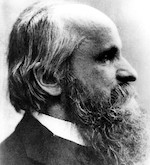

# Digital Meinong

## Contents

- Works
  - [Über Gegenstandstheorie](#über-gegenstandstheorie)

## Über Gegenstandstheorie

- HTML: <https://ozekik.github.io/meinong/1904/>
- Markdown: <https://github.com/ozekik/meinong/blob/master/1904/index.md>

Modifications from the original text:

- Sperrsatz is replaced with italic
- Small caps are ignored
- Every original page number inserted is always placed *after* the word at the end of each page

Supplemental sources to 1913 edition:

- Alexius Meinong, "Über Gegenstandstheorie". In: *Untersuchungen zur Gegenstandstheorie und Psychologie*, A. Meinong (ed.), J. A. Barth, 1904, pp. 1–50.
- Alexius Meinong, "Über Gegenstandstheorie". In: *Alexius Meinong Gesamtausgabe*, Vol. 2, R. Haller (ed.), Akademische Druck- u. Verlagsanstalt, 1971, pp. 481–530. [A reprint of 1913 edition]
- Alexius Meinong, "Über Gegenstandstheorie". In: *Über Gegenstandstheorie. Selbstdarstellung*, J. M. Werle (ed.), Felix Meiner, 1988, pp. 1–51.
